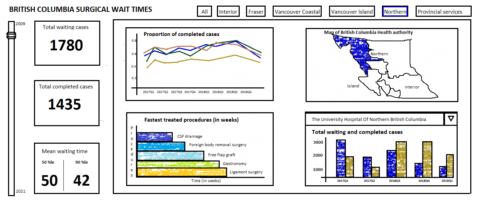

# BC Surgical Wait Times (Group D)

- This dashoard will demonstrate the total waiting and completed surgical cases across the health authorities and hospitals.
- It will also display the efficiency of different health authorities of BC and the wait time of different procedures will also be demonstrated.
- Alongside, it will enable the user to observe the impact of pandemic on the efficiency of health authorities or procedures.

## Team Members

- Jagdeep Brar: A data science student who loves cooking and painting in free time!
- Saisree GR: An ethusiastic student and researcher who loves data science, hot chocolate and reading books 🤓
- Song Zhang: An analytical, dependable, and responsible person.
- Roger Wheeler: A Chartered Professional in Human Resources (CPHR) with a strong interest in analytics.

## Describe your topic/interest in about 150-200 words

Long waiting times is an important issue for health services in Canada, and the main concern is about waiting times for elective treatments [[1]("https://www.oecd-ilibrary.org/social-issues-migration-health/waiting-times-for-health-services_242e3c8c-en")],. Among the OECD countries, Canada’s waiting times problem ranks in the medium-high priority level, while Germany, Korea, Japan, Switzerland, and U.S rank in low priority level [[2]("https://www.oecd-ilibrary.org/sites/242e3c8c-en/1/3/1/index.html?itemId=/content/publication/242e3c8c-en&_csp_=e90031be7ce6b03025f09a0c506286b0&itemIGO=oecd&itemContentType=book#chapter-d1e287")]. After the COVID-19 outbreak, tens of thousands of scheduled surgeries being cancelled or postponed across Canada, which prolonged the surgical wait times. In B.C. province, between Mar. 16 and May 18, 2020, it was estimated that 30298 elective nonurgent surgeries were either postponed or not scheduled because of the COVID-19 pandemic [[3]("https://www2.gov.bc.ca/assets/gov/health/conducting-health-research/surgical-renewal-plan.pdf")]. If we could have a public dashboard of surgical data like that of COVID-19 for the province, it will help both the patients to know the situation and the doctors as well as the health authorities to look at where improvements are most needed [[4]("https://bc.ctvnews.ca/b-c-doctors-criticize-top-down-approach-and-government-secrecy-as-minister-defends-surgical-strategy-1.5767547")]. Our app will show how many waiting and completed cases in B.C. and allow users to check the trend of completed cases proportion and the waiting times for different procedures in by filtering different health authorities, hospitals, and procedures.

## About this Dashboard

The app opens a dashboard that shows the information about surgical waiting times in the province of British Columbia, Canada. Users can select health authorities of BC from the buttons (eg, Northern, Interior, Vancouver Island, Vancouver Coastal etc.) and years from the slider which will update the 4 charts (proportion of completed cases, BC health authority map, Fastest/Slowest treated procedures, total waiting and completed cases of a hospital ) and information cards accordingly. The proportion of completed cases chart shows quarterly distribution of completed cases of all health authorities based on the selected years. The BC health authority map highlights the selected health authority. The fastest/slowest treated procedures chart has the option to select between fastest and slowest radio buttons. The total waiting and completed cases of a hospital has a dropdown menu of different hospitals based on the selected health authority.

## Describe your dataset in about 150-200 words

This dataset provides information of elective surgical procedures' wait times in British Columbia. This dataset contains the information of patients of all ages and only the scheduled surgical cases not the unscheduled ones. The data is collected quartely at the end of each quarter from year 2009 to 2021. The dataset has the following variables:

1. **Quarter** : The quarter for which data is collected.
2. **Year** : The year for which data is collected.
3. **Waiting** : The number of surgical cases waiting at the end each quarter 
4. **Completed**: The number of surgical cases completed within each quarter.
5. **Health authority**: The health authority of the hospital from where data is collected.
6. **Hospital name**: The name of the hospital where the surgical procedures are performed.
7. **Procedure group**: The name of the surgical procedure type and data has 83 unique procedures.
8. **Completed 50th percentile**: For completed procedures, the number of weeks 50th percentile of the patients waited for surgery.
9. **Completed 90th percentile**: For completed procedures, the number of weeks 90th percentile of the patients waited for surgery.

**Dimesion of data**: The dataset has total 151277 observation for 9 variables, and after removing the missing values or low volume procedures (<=5) due to privacy concern, clean dataset consist of 122086 observations. 

## Acknowledgements and references 

This dataset comes from BC government [https://catalogue.data.gov.bc.ca/dataset/bc-surgical-wait-times/resource/f294562c-a6fd-4d7f-8f99-c51c91891c67](https://catalogue.data.gov.bc.ca/dataset/bc-surgical-wait-times/resource/f294562c-a6fd-4d7f-8f99-c51c91891c67)
